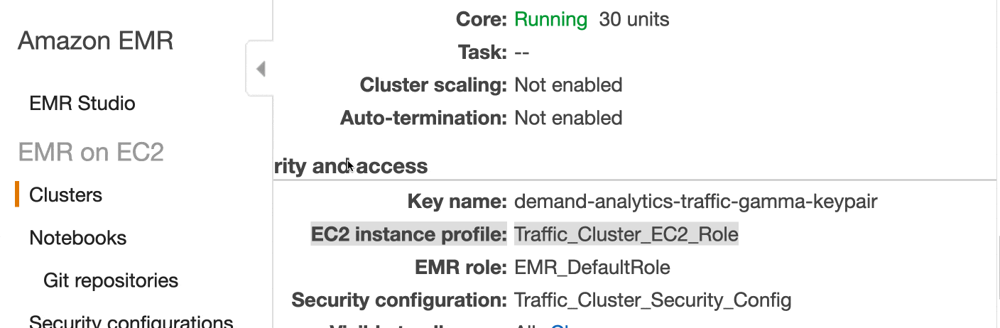
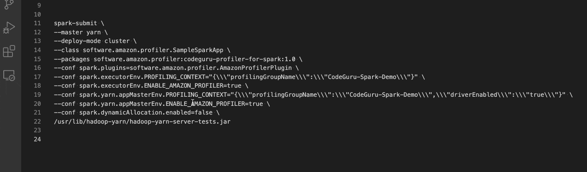
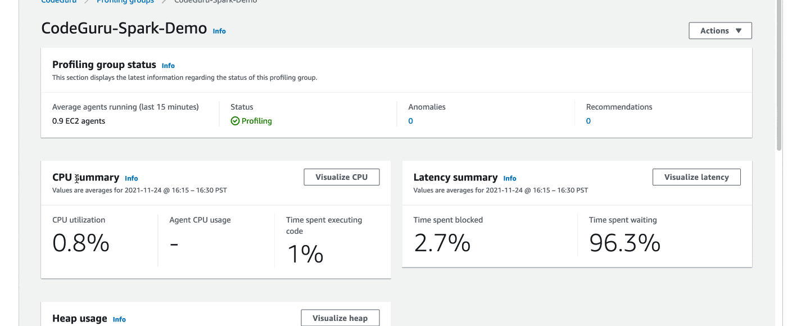

## Context

Spark 3 introduces SparkPlugin, allowing us to create a plugin which is automatically instantiated within Spark driver and executors.  For each plugin specified in the `spark.plugins` configuration, an instance will be created for every executor, including those created by dynamic allocation, before the executor starts running any tasks.

Given that, this package is created to enable CPU and memory profiling for any JVM based Spark app using AWS CodeGuru Profiler.  With visibility into the runtime characteristics of your Spark app, you would have the opportunity to improve SLA and reduce IMR cost by identifying bottlenecks and inefficiencies from profiling results.  Internally, it has helped us to identify issues like thread contentions and unnecessary expensive object creation of AWS service clients.

## License

This project is licensed under the Apache-2.0 License.

## Security

See [CONTRIBUTING](CONTRIBUTING.md#security-issue-notifications) for more information.

## Prerequisites

- Your app is built and run against Spark 3.x

### Spark on EMR

- To leverage any Spark plugin, your EMR cluster needs to be run on release 6.x or newer, and `spark.plugins` needs to be specified when a Spark job is submitted.

### Spark on AWS Glue

- To leverage any Spark plugin, you should be on AWS Glue 3 or Newer, and `spark.plugins` needs to be specified when Glue job is submitted.

## Onboarding Steps

- Create a profiling group in CodeGuru Profiler and grant permission to your EMR EC2 role so that profiler agents can emit metrics to CodeGuru.  Detailed instructions can be found [here](https://docs.aws.amazon.com/codeguru/latest/profiler-ug/setting-up-long.html).



### Spark on EMR

- Reference `codeguru-profiler-for-spark` via `--packages` (or `--jars`) when submitting your Spark job, along with `PROFILING_CONTEXT` and `ENABLE_AMAZON_PROFILER` defined. Below is an example where the profling group created in the previous step is assumed to be `CodeGuru-Spark-Demo`.

```
spark-submit \
--master yarn \
--deploy-mode cluster \
--class <main-class-in-your-spark-app> \
--packages software.amazon.profiler:codeguru-profiler-for-spark:1.0 \
--conf spark.plugins=software.amazon.profiler.AmazonProfilerPlugin \
--conf spark.executorEnv.PROFILING_CONTEXT="{\\\"profilingGroupName\\\":\\\"CodeGuru-Spark-Demo\\\"}" \
--conf spark.executorEnv.ENABLE_AMAZON_PROFILER=true \
--conf spark.yarn.appMasterEnv.PROFILING_CONTEXT="{\\\"profilingGroupName\\\":\\\"CodeGuru-Spark-Demo\\\",\\\"driverEnabled\\\":\\\"true\\\"}" \
--conf spark.yarn.appMasterEnv.ENABLE_AMAZON_PROFILER=true \
--conf spark.dynamicAllocation.enabled=false \
<the-s3-object-key-of-your-spark-app-jar>
```

- An alternative way to specify `PROFILING_CONTEXT` and `ENABLE_AMAZON_PROFILER` is via the AWS EMR web console.  Go to the Configurations tab of your EMR cluster and configure both environment variables under the `yarn-env.export` classification for instance groups.  Please note that `PROFILING_CONTEXT`, if configured in the web console, needs to escape all the commas on top of what's for the above spark-submit command.
```json
[{
  "classification": "yarn-env",
  "properties": {},
  "configurations": [{
    "classification": "export",
    "properties": {
      "ENABLE_AMAZON_PROFILER": "true",
      "PROFILING_CONTEXT": "{\\\"profilingGroupName\\\":\\\"CodeGuru-Spark-Demo\\\"\\,\\\"driverEnabled\\\":\\\"true\\\"}"
    },
    "configurations": []
  }]
}]
```

### Spark on AWS Glue

- Upload `codeguru-profiler-for-apache-spark.jar` to S3 and add the jar s3 path through `--extra-jars` parameter when using AWS Glue API. More details on AWS Glue API can be found [here](https://docs.aws.amazon.com/glue/latest/dg/aws-glue-programming-etl-glue-arguments.html#w6aac28c11b8c11).
- Then, you need to specify the `PROFILING_CONTEXT` and `ENABLE_AMAZON_PROFILER` properties through `--conf` parameter when using AWS Glue API. A Sample value for `--conf` parameter would look like below:  
  `spark.plugins=software.amazon.profiler.AmazonProfilerPlugin --conf spark.executorEnv.ENABLE_AMAZON_PROFILER=true --conf spark.executorEnv.PROFILING_CONTEXT={"profilingGroupName":"CodeGuru-Spark-Demo"} --conf spark.yarn.appMasterEnv.ENABLE_AMAZON_PROFILER=true --conf spark.yarn.appMasterEnv.PROFILING_CONTEXT={"profilingGroupName":"CodeGuru-Spark-Demo", "driverEnabled": "true"}`.  

***Note:*** AWS Glue doesn't support passing multiple `--conf` parameters, so when you're passing more than one `--conf` parameters such as `--conf k1=v1 --conf k2=v2`, The key and value for Glue API would look like below:   
  *Key:* `--conf`  
  *Value:* `k1=v1 --conf k2=v2`


## Troubleshooting Tips

### Spark on EMR

If profiling results do not show up in the CodeGuru web console of your AWS account, you can fire off a Spark shell from the master node of your EMR cluster and then check if your environment variables are correctly set up.  For example,

```
spark-shell \
--master yarn \
--deploy-mode client \
--conf spark.plugins=software.amazon.profiler.AmazonProfilerPlugin \
--conf spark.executorEnv.PROFILING_CONTEXT="{\\\"profilingGroupName\\\":\\\"CodeGuru-Spark-Demo\\\"}" \
--conf spark.executorEnv.ENABLE_AMAZON_PROFILER=true \
--conf spark.dynamicAllocation.enabled=false \
--jars s3://<your-s3-bucket>/codeguru-profiler-for-spark-1.0.jar
```

```scala
scala> val rdd = sc.parallelize(1 to 3, 2)
scala> rdd.map(x => System.getenv("ENABLE_AMAZON_PROFILER")).collect.foreach(println)
true
true
true

scala> rdd.map(x => System.getenv("PROFILING_CONTEXT")).collect.foreach(println)
{"profilingGroupName":"CodeGuru-Spark-Demo"}
{"profilingGroupName":"CodeGuru-Spark-Demo"}
{"profilingGroupName":"CodeGuru-Spark-Demo"}
```

To help you with troubleshooting, this package provides a sample Spark app which you can use to check if everything is set up correctly.

```
spark-submit \
--master yarn \
--deploy-mode cluster \
--class software.amazon.profiler.SampleSparkApp \
--packages software.amazon.profiler:codeguru-profiler-for-spark:1.0 \
--conf spark.plugins=software.amazon.profiler.AmazonProfilerPlugin \
--conf spark.executorEnv.PROFILING_CONTEXT="{\\\"profilingGroupName\\\":\\\"CodeGuru-Spark-Demo\\\"}" \
--conf spark.executorEnv.ENABLE_AMAZON_PROFILER=true \
--conf spark.yarn.appMasterEnv.PROFILING_CONTEXT="{\\\"profilingGroupName\\\":\\\"CodeGuru-Spark-Demo\\\",\\\"driverEnabled\\\":\\\"true\\\"}" \
--conf spark.yarn.appMasterEnv.ENABLE_AMAZON_PROFILER=true \
--conf spark.dynamicAllocation.enabled=false \
/usr/lib/hadoop-yarn/hadoop-yarn-server-tests.jar
```



Once you run the above command from the master node of your EMR cluster, you should expect that the driver node has logs similar to

```
21/11/21 21:27:15 INFO BasePlugin: Profiling is enabled
21/11/21 21:27:15 INFO DriverPluginContainer: Initialized driver component for plugin software.amazon.profiler.AmazonProfilerPlugin.
...
21/11/21 21:27:15 INFO SparkDriverPlugin: Profiling context: ProfilingContext(profilingGroupName=CodeGuru-Spark-Demo, driverEnabled=true, executorEnabled=true, heapSummaryEnabled=true)
21/11/21 21:27:15 INFO BasePlugin: Profiling is being started
21/11/21 21:27:15 INFO Profiler: Starting the profiler : ProfilerParameters{profilingGroupName='CodeGuru-Spark-Demo', threadSupport=BasicThreadSupport (default), excludedThreads=[Signal Dispatcher, Attach Listener], shouldProfile=true, integrationMode='', memoryUsageLimit=104857600, heapSummaryEnabled=true, stackDepthLimit=1000, samplingInterval=PT1S, reportingInterval=PT5M, addProfilerOverheadAsSamples=true, minimumTimeForReporting=PT1M, dontReportIfSampledLessThanTimes=1}
21/11/21 21:27:15 INFO ProfilingCommandExecutor: Profiling scheduled, sampling rate is PT1S
...
21/11/21 21:27:17 INFO ProfilingCommand: New agent configuration received : AgentConfiguration(AgentParameters={MaxStackDepth=1000, MinimumTimeForReportingInMilliseconds=60000, SamplingIntervalInMilliseconds=1000, MemoryUsageLimitPercent=10, ReportingIntervalInMilliseconds=300000}, PeriodInSeconds=300, ShouldProfile=true)
...
21/11/21 21:32:18 INFO ProfilingCommand: Attempting to report profile data: start=2021-11-21T21:27:17.819Z end=2021-11-21T21:32:17.738Z force=false memoryRefresh=false numberOfTimesSampled=300
21/11/21 21:32:18 INFO javaClass: [HeapSummary] Processed 12 events.
21/11/21 21:32:18 INFO ProfilingCommand: Successfully reported profile
```

You should also expect that an executor node has logs similar to

```
21/11/21 21:27:21 INFO BasePlugin: Profiling is enabled
21/11/21 21:27:21 INFO ExecutorPluginContainer: Initialized executor component for plugin software.amazon.profiler.AmazonProfilerPlugin.
21/11/21 21:27:21 INFO SparkExecutorPlugin: Profiling context: ProfilingContext(profilingGroupName=CodeGuru-Spark-Demo, driverEnabled=false, executorEnabled=true, heapSummaryEnabled=true)
21/11/21 21:27:21 INFO YarnCoarseGrainedExecutorBackend: Got assigned task 1
21/11/21 21:27:21 INFO BasePlugin: Profiling is being started
21/11/21 21:27:21 INFO Executor: Running task 1.0 in stage 0.0 (TID 1)
21/11/21 21:27:21 INFO Profiler: Starting the profiler : ProfilerParameters{profilingGroupName='CodeGuru-Spark-Demo', threadSupport=BasicThreadSupport (default), excludedThreads=[Signal Dispatcher, Attach Listener], shouldProfile=true, integrationMode='', memoryUsageLimit=104857600, heapSummaryEnabled=true, stackDepthLimit=1000, samplingInterval=PT1S, reportingInterval=PT5M, addProfilerOverheadAsSamples=true, minimumTimeForReporting=PT1M, dontReportIfSampledLessThanTimes=1}
21/11/21 21:27:21 INFO ProfilingCommandExecutor: Profiling scheduled, sampling rate is PT1S
...
21/11/21 21:27:23 INFO ProfilingCommand: New agent configuration received : AgentConfiguration(AgentParameters={MaxStackDepth=1000, MinimumTimeForReportingInMilliseconds=60000, SamplingIntervalInMilliseconds=1000, MemoryUsageLimitPercent=10, ReportingIntervalInMilliseconds=300000}, PeriodInSeconds=300, ShouldProfile=true)
21/11/21 21:32:23 INFO ProfilingCommand: Attempting to report profile data: start=2021-11-21T21:27:23.227Z end=2021-11-21T21:32:22.765Z force=false memoryRefresh=false numberOfTimesSampled=300
21/11/21 21:32:23 INFO javaClass: [HeapSummary] Processed 20 events.
21/11/21 21:32:24 INFO ProfilingCommand: Successfully reported profile
```

## Sample Profiling Results


